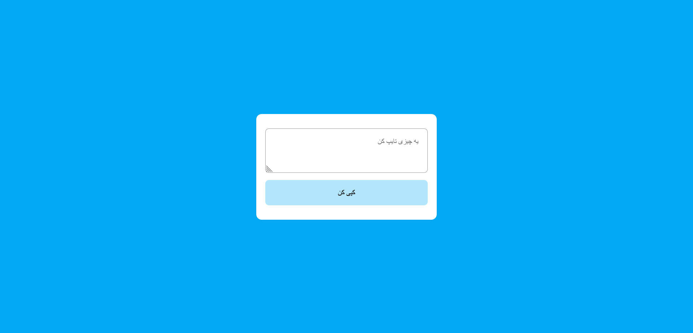

<h1 align="center">Copy to Clipboard</h1>

This is a JS mini project for practice.

### Screenshot

### I learned

- css <b>::selection</b>
- js <b>select()</b> method
- js <b>navigator.clipboard.writeText()</b> for copy text to clipboard

### Built with

- Semantic HTML5 markup
- CSS custom properties
- Flexbox
- Mobile-first workflow
- pure javascript
